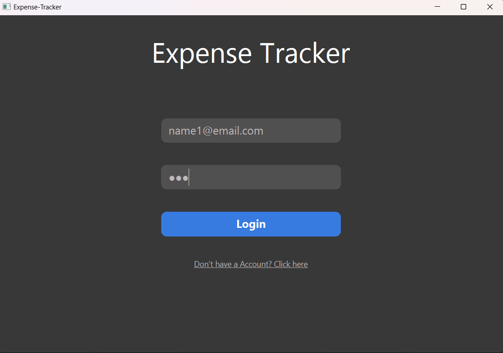
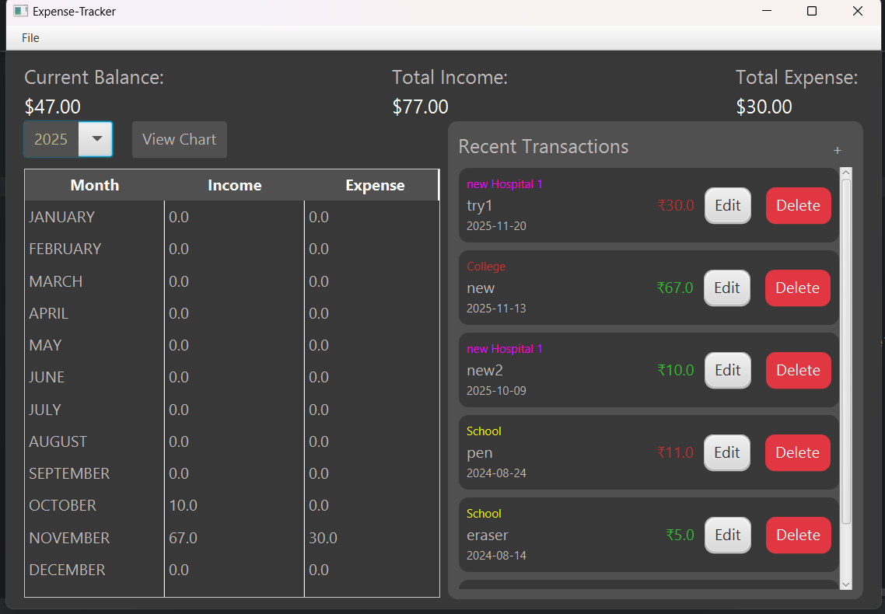
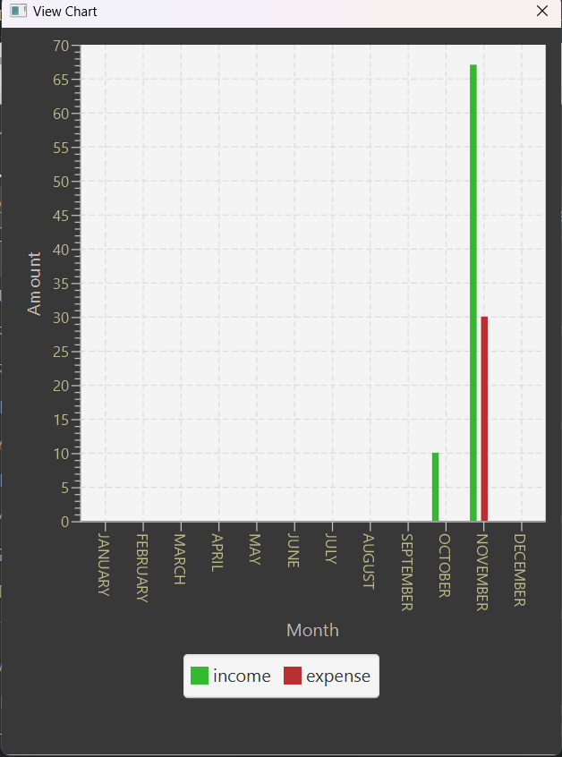
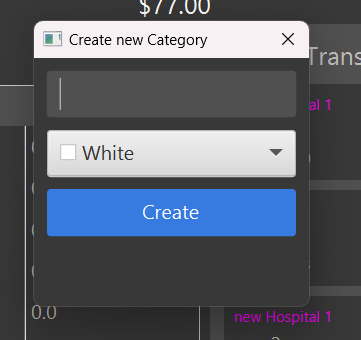
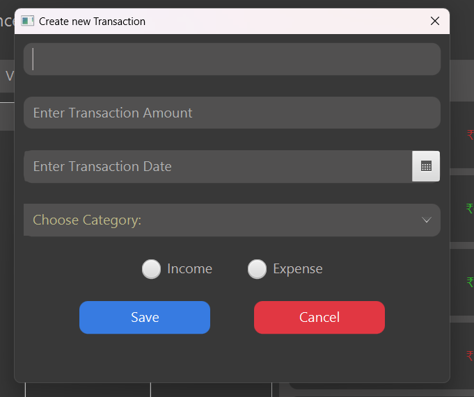
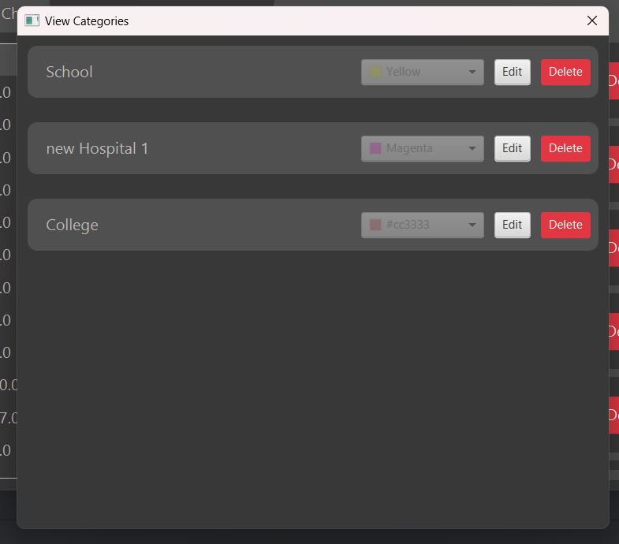
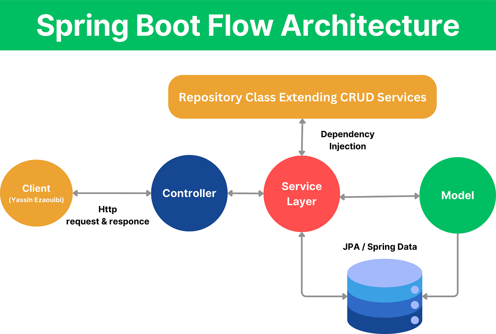
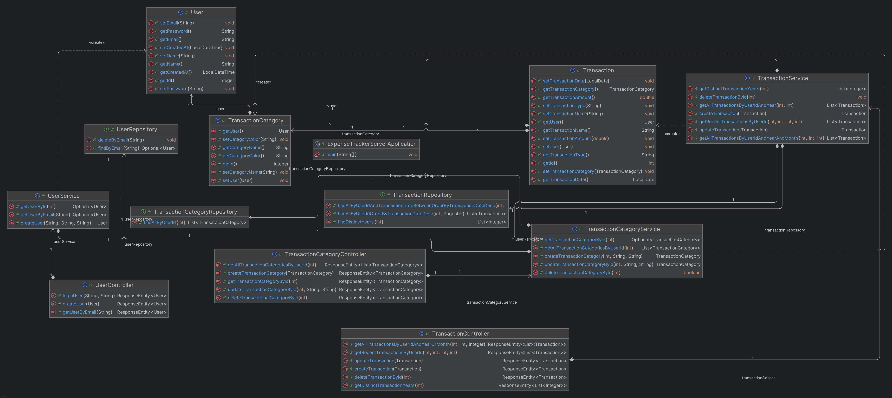
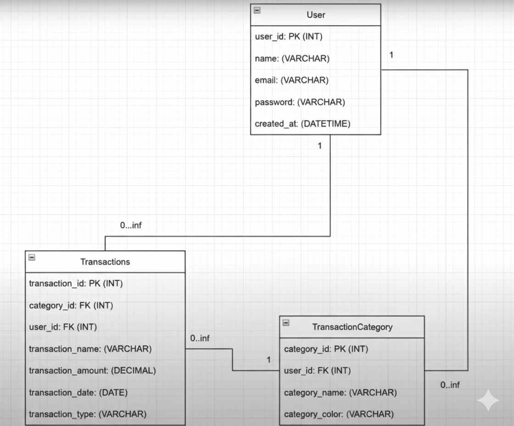

# Full-Stack Expense Tracker

A comprehensive desktop application designed to help users manage and visualize their personal finances. Built as a full-stack project, it provides a secure, interactive platform for tracking income and expenses.

## Application ScreenShots

### Login Page

### Dashboard

### Bar Graph for the selected year expenses

### Create Category(With color picker)

### Transaction Creation with drop down of category selection

### View Existing Categories

---

## ✨ Features

* **User Authentication:** Secure login and sign-up system to manage individual user accounts.
* **Transaction Management:** Full CRUD (Create, Read, Update, Delete) functionality for managing financial transactions.
* **Dashboard Overview:** A clean dashboard providing a real-time summary of current balance, total income, and total expenses.
* **Dynamic Categorization:** Users can create, view, edit, and delete custom categories (e.g., "School," "College," "Hospital") for better organization.
* **Data Visualization:** An interactive bar chart to visualize monthly income vs. expenses, making it easy to analyze spending habits.
* **Monthly Breakdown:** A detailed table showing a month-by-month breakdown of financial activity.

---

## 💻 Technology Stack

This project is built using a modern full-stack architecture.

* **Frontend:** JavaFX
* **Backend:** Spring Boot (REST API)
* **Database:** MySQL
* **Build Tool:** Maven

---

## Spring Boot Flow Architecture

This project follows a 3-layered architecture (Controller → Service → Repository), using Spring Boot and JPA for backend development.

1. User

- Represents the system’s users.
- Fields: id, name, email, password, createdAt
- Each user can have multiple transactions and categories.
- Provides getter/setter methods.

2. UserRepository

- Data-access layer for User.
- findByEmail(String) → fetch user by email
- deleteByEmail(String) → delete user by email

3. UserService

- Business logic layer for users.
- getUserById(int)
- getUserByEmail(String)
- createUser(String name, String email, String password)

4. UserController

- Exposes REST endpoints for user management.
- loginUser(String, String) → authenticate user
- createUser(User) → register new user
- getUserByEmail(String) → fetch user by email

5. Transaction

- Represents a financial transaction.
- Fields: id, transactionName, transactionAmount, transactionType, transactionDate
- Linked to both User and TransactionCategory.

6. TransactionRepository

- Data-access layer for Transaction.
- findAllByUserIdAndTransactionDateBetweenOrderByTransactionDateDesc(...)
- findAllByUserIdOrderByTransactionDateDesc(...)
- findDistinctYears(int)

7. TransactionService

- Business logic for transactions.
- getDistinctTransactionYears(int)
- deleteTransactionById(int)
- getAllTransactionsByUserIdAndYear(int, int)
- createTransaction(Transaction)
- getRecentTransactionsByUserId(int, int, int)
- updateTransaction(Transaction)
- getAllTransactionsByUserIdAndYearAndMonth(int, int, int)

8. TransactionController

- REST endpoints for transactions.
- Get all transactions by user/year/month
- Fetch recent transactions
- Create/update/delete transactions
- Get distinct transaction years

9. TransactionCategory

- Represents categories for organizing transactions (e.g., Food, Travel, Bills).
- Fields: id, categoryName, categoryColor
- Linked to a User

10. TransactionCategoryRepository

- Data-access layer for categories.
- findAllByUserId(int) → fetch categories of a user

11. TransactionCategoryService

- Business logic for categories.
- getTransactionCategoryById(int)
- getAllTransactionCategoriesByUserId(int)
- createTransactionCategory(int userId, String name, String color)
- updateTransactionCategoryById(int, String, String)
- deleteTransactionCategoryById(int)

12. TransactionCategoryController

- REST endpoints for category management.
- getAllTransactionCategoriesByUserId(int)
- createTransactionCategory(TransactionCategory)
- getTransactionCategoryById(int)
- updateTransactionCategoryById(int, String, String)
- deleteTransactionCategoryById(int)

13. ExpenseTrackerServerApplication

- Main entry point of the Spring Boot application.
- Contains main(String[] args) to bootstrap the server

## Expense Tracker Server UML Diagram

## ER Diagram

## 🚀 Getting Started

To get a copy of this project up and running on your local machine, follow these steps.

### **Prerequisites**

* Java JDK 17 or higher
* Maven
* MySQL Server

### **Database Setup**

1.  Clone the repository:
    `git clone https://github.com/Siddharth3271/Full-Stack-Expense-Tracker.git`
2.  Navigate to the `Expense-Tracker-Server` directory.
3.  Create a MySQL database named `expense_tracker_db`.
4.  Run the SQL script located at `src/main/resources/schema.sql` to create the necessary tables.
5.  Update the database configuration in `src/main/resources/application.properties` with your MySQL credentials.

### **Running the Application**

The application is split into two modules: the server (backend) and the client (frontend).

1.  **Start the Server:**
    * Open a terminal and navigate to the `Expense-Tracker-Server` directory.
    * Run the command:
        `mvn spring-boot:run`
    * The server will start on `http://localhost:8081`.

2.  **Start the Client:**
    * Open a new terminal and navigate to the `Expense-Tracker-Client` directory.
    * Run the command:
        `mvn javafx:run`
    * The JavaFX application window will open.
3. If using Intellj -> just run the server and then client

---

## ✍️ Contribution

This is a personal project, but feel free to open issues or submit pull requests. All contributions are welcome.

---

## Future Integrations
- Adding google authorization
- Yearly Bar Graph Statistics
- Making its execuatble file
